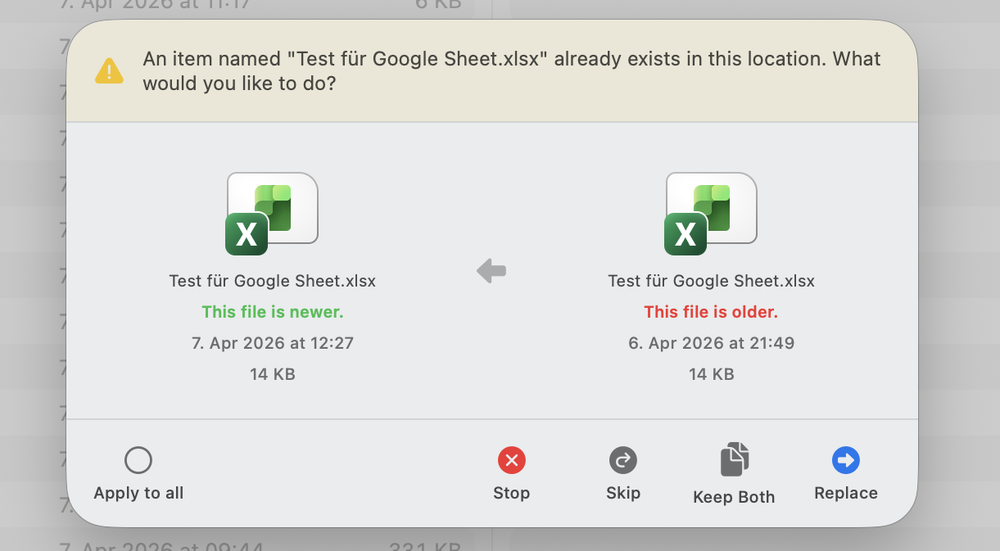

# FileFluss 0.7 Beta

## New Features

### Professional Conflict Resolution Dialog

When copying or moving files that already exist at the destination, FileFluss now shows a rich, side-by-side comparison dialog instead of a basic system prompt:

- **Side-by-side file comparison** — see both the source and destination file with their modification dates, sizes, and native file icons at a glance
- **Newer/older indicators** — green and red labels instantly show which file is newer
- **Directional awareness** — the arrow in the dialog matches the actual transfer direction between panels
- **Apply to All** — apply your choice (Skip, Replace, Keep Both) to all remaining conflicts in one click, no more repeated prompts
- **Keep Both** — automatically renames the incoming file with a numeric suffix (e.g. "report 2.pdf") so nothing is overwritten
- **Stop** — cancel the entire operation at any point while keeping files already transferred

### Smarter Cloud-to-Cloud Transfers

- **Pre-flight conflict checking** — when transferring between cloud providers, FileFluss now checks for conflicts *before* downloading files, saving bandwidth and time
- **Preserved modification dates** — files transferred from cloud storage now retain their original modification dates instead of showing the download timestamp

## Bug Fixes

- Fixed "Skip All" not persisting across an entire file operation
- Fixed false conflict dialogs appearing when copying to empty cloud folders (caused by Google Workspace format conversion)
- Fixed crash when cloud folders contained items with duplicate names

## Full Changelog

See the [commit history](https://github.com/rana-gmbh/filefluss/commits/main) for the complete list of changes.
